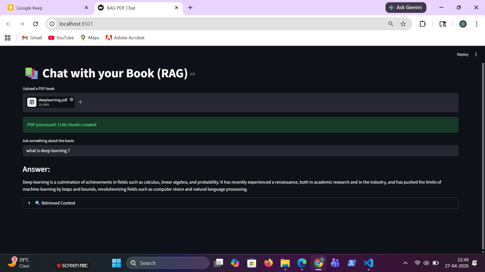

# 📚 RAG Chat Book

A Retrieval-Augmented Generation (RAG) based application that allows users to upload books (PDFs) and interact with them through natural language queries.

Instead of reading entire documents manually, this system enables **context-aware question answering** using LLMs and vector search.

---

## 🚀 Features

- 📄 Upload PDF books
- ✂️ Automatic text chunking
- 🔍 Semantic search using embeddings
- 🤖 Context-aware answers using LLM
- 💬 Interactive chat interface
- ⚡ Fast retrieval with vector database (Chroma)

---

## 🖼️ UI Overview



---

## 🧠 How It Works

1. **Document Upload**
   - User uploads a PDF file

2. **Text Processing**
   - PDF is loaded and split into chunks

3. **Embedding Generation**
   - Each chunk is converted into vector embeddings

4. **Vector Storage**
   - Stored in Chroma vector database

5. **Query Handling**
   - User asks a question
   - Relevant chunks are retrieved using similarity search

6. **LLM Response**
   - Retrieved context + user query → passed to LLM
   - AI generates accurate, context-based answer

---

## 🛠️ Tech Stack

- **LangChain** – RAG pipeline
- **HuggingFace Embeddings** – Vector representation
- **ChromaDB** – Vector database
- **Mistral AI (or any LLM)** – Response generation
- **Python** – Core backend
- **Streamlit (optional)** – UI

---

## ⚙️ Installation

```bash
git clone https://github.com/onkarlonkar9/RAG-Chat-Book.git
cd RAG-Chat-Book
pip install -r requirements.txt
```
🔑 Environment Variables

Create a .env file and add your API key:
```bash
MISTRAL_API_KEY=your_api_key_here
```
▶️ Usage
```bash
streamlit run ui.py
```

OR (if CLI-based)

python app.py
💡 Example Queries
"What is machine learning?"
"Summarize chapter 2"
"Explain key concepts in this book"
"Give important points from this document"
⚠️ Limitations
Depends on quality of embeddings
Large PDFs may increase processing time
LLM responses may not always be 100% accurate
🔥 Future Improvements
Multi-document support
Better UI/UX
Chat history memory
Source citation in answers
Hybrid search (keyword + semantic)
🤝 Contributing

Pull requests are welcome. For major changes, open an issue first.

📌 Author

Onkar Lonkar

⭐ Support

If you find this useful, give it a ⭐ on GitHub.


---

### One important thing (don’t skip this)

Right now your README references this image:


./ui.png


👉 So you need to:
1. Create a folder `assets`
2. Put your UI screenshot inside it
3. Rename it to `ui-overview.png`

---

If you want, I can:
- Rewrite this to look like a **top-tier GitHub trending repo**
- Add **badges, demo GIF, architecture diagram**
- Or make a **portfolio-grade README that impresses recruiters**

Just say it.
